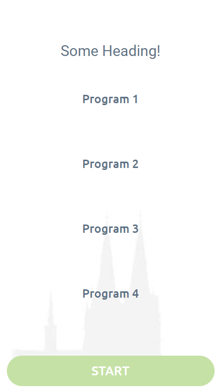
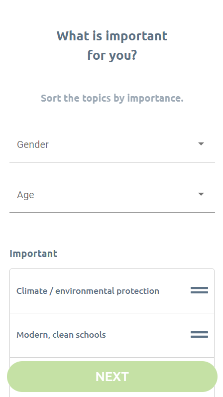
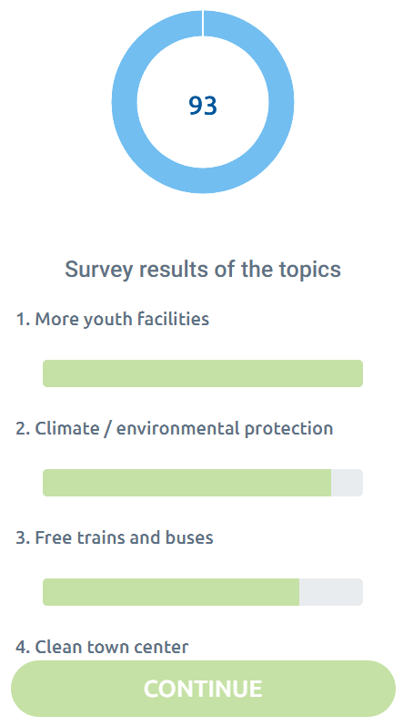

# Wahlapp

### About

This project was made for a local election to gather information about voters and their most important topics using  [Angular CLI](https://github.com/angular/angular-cli) version 10.0.3.

It was made primarily for mobile use so PWA is supported.

As shown in the screenshots the pages/screens are made as following:
1. Little introduction, some headings and program information 2
2. Voters most important topic selection/survey and some personal infos
3. Some options to submit some more information
4. An overview about other peoples important topics

<table>
<tr>
<th></th>
<th></th>
<th></th>
<th></th>
</tr>
</table>

### Getting started

This projects consists of a frontend written in angular and a backend with expressjs.

The frontend can be hosted on a static page like Github pages after it has been build (`npm run build` then copy the content from the build directory). For quick debugging, testing you can just do this:

    git clone <this_project>
    cd <this_project>
    npm i
    npm run start

It should now be accessible under `localhost:4200`.

For the backend/api with docker compose:

    cd api/
    npm i
    docker-compose up -d

### Development server

Run `ng serve` for a dev server. Navigate to `http://localhost:4200/`. The app will automatically reload if you change any of the source files.

### Code scaffolding

Run `ng generate component component-name` to generate a new component. You can also use `ng generate directive|pipe|service|class|guard|interface|enum|module`.

### Build

Run `ng build` to build the project. The build artifacts will be stored in the `dist/` directory. Use the `--prod` flag for a production build.

### Running unit tests

Run `ng test` to execute the unit tests via [Karma](https://karma-runner.github.io).

### Running end-to-end tests

Run `ng e2e` to execute the end-to-end tests via [Protractor](http://www.protractortest.org/).

### Help

Contributions are welcome.